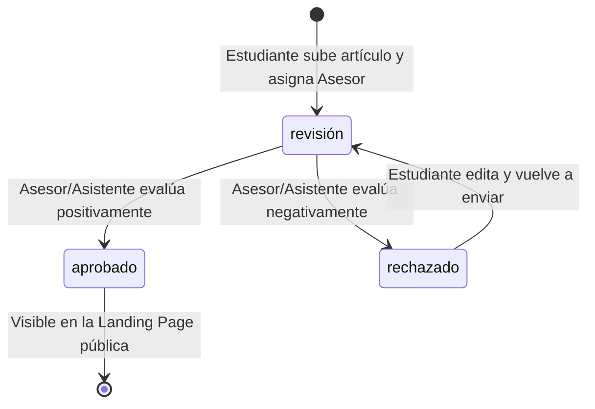
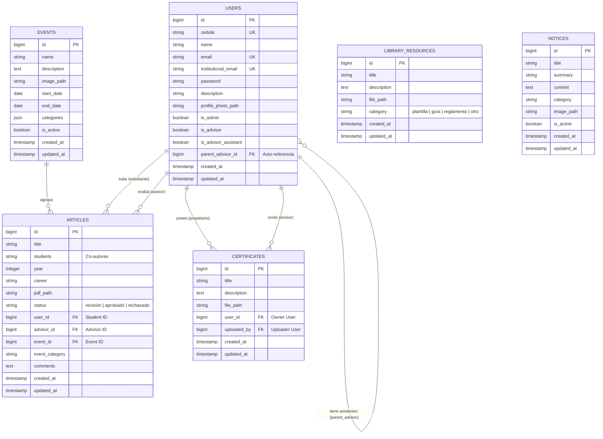

# 🚀 UTP Académico - Sistema de Gestión de Investigaciones

Este proyecto es una plataforma web centralizada diseñada para la Universidad Tecnológica de Panamá (UTP) que facilita la gestión, envío, evaluación y archivo de artículos de investigación, eventos científicos, recursos de biblioteca y credenciales académicas.

---

## 🛠️ Stack Tecnológico

El proyecto está construido utilizando un stack moderno, ligero y altamente eficiente:

*   **Backend:** [Laravel 12 / 11](https://laravel.com/) (PHP 8.2+)
*   **Frontend:** [Blade Templates](https://laravel.com/docs/11.x/blade) + [Tailwind CSS](https://tailwindcss.com/) + [Alpine.js](https://alpinejs.dev/) + [Vite](https://vitejs.dev/)
*   **Diseño:** *Cyber Purple System* (Estética futurista con Glassmorphism, contrastes de luces de neón y animaciones suaves).
*   **Base de Datos:** SQLite (persistida en volumen local o contenedor).
*   **Servidor Web:** Nginx (Alpine Liquid) para producción/Docker.
*   **Infraestructura:** Docker & Docker Compose para un despliegue y desarrollo local unificados.

---

## 📋 Descripción del Proyecto y Propósito

### El Problema
En muchas instituciones académicas existe una fragmentación en la gestión de trabajos de investigación, eventos y recursos compartidos. Los estudiantes carecen de un canal centralizado para subir artículos, asignar asesores y recibir evaluaciones; los asesores enfrentan dificultades para gestionar revisiones y dar seguimiento; y los administradores no cuentan con herramientas eficaces para supervisar, archivar y publicar resultados.

### La Solución
**UTP Académico** digitaliza y simplifica este ciclo de trabajo para:
*   Ofrecer una plataforma única de recepción y almacenamiento de artículos.
*   Automatizar la asignación y flujo de evaluación de artículos.
*   Centralizar convocatorias a eventos académicos y catalogar recursos de biblioteca.
*   Gestionar y emitir certificados académicos de forma segura.

---

## 👤 Roles de Usuario y Permisos

El sistema implementa un control de acceso basado en el perfil del usuario mediante banderas booleanas en la tabla `users`:

```mermaid
graph TD
    User[Usuario Registrado] --> Student[Estudiante (Rol por Defecto)]
    User --> Advisor[Asesor (is_advisor = true)]
    User --> Assistant[Asistente de Asesor (is_advisor_assistant = true)]
    User --> Admin[Administrador (is_admin = true)]
```

### 1. Estudiante (Student)
*   **Envío de Artículos:** Puede registrar artículos académicos ingresando título, coautores, año, carrera, archivo PDF, evento y categoría.
*   **Seguimiento:** Visualiza el estado actual de sus artículos (`revisión`, `aprobado`, `rechazado`) y los comentarios de su asesor.
*   **Biblioteca y Eventos:** Explora y descarga guías/plantillas en la biblioteca, y visualiza los eventos activos de la universidad.
*   **Certificados:** Puede subir y organizar sus propios certificados académicos.

### 2. Asesor (Advisor)
*   **Evaluación de Artículos:** Tiene acceso para ver y evaluar los artículos que los estudiantes le han asignado. Puede cambiar el estado a `aprobado` o `rechazado` e incluir comentarios de retroalimentación.
*   **Gestión de Asistentes:** Puede registrar y remover cuentas de "Asistentes de Asesor" vinculadas a su perfil para delegar revisiones.
*   **Emisión de Certificados:** Puede emitir certificados digitales directamente a los estudiantes que tienen artículos asignados bajo su tutela.

### 3. Asistente de Asesor (Advisor Assistant)
*   **Delegación:** Vinculado a un Asesor principal (`parent_advisor_id`).
*   **Evaluación:** Puede realizar evaluaciones y comentar en los artículos asignados al asesor principal.
*   **Certificados:** Puede visualizar y subir certificados.

### 4. Administrador (Admin)
*   **Acceso Completo:** Resguardado bajo el middleware `admin` en rutas `/admin/*`.
*   **Gestión de Usuarios:** Puede ver la lista completa de usuarios registrados y eliminar cuentas.
*   **Gestión de Artículos:** Búsqueda global y visualización de todos los artículos cargados en la plataforma.
*   **Anuncios y Noticias (Notices):** CRUD completo de comunicados institucionales.
*   **Eventos:** Creación, edición y desactivación de convocatorias de eventos con fechas, imágenes y categorías en formato JSON.
*   **Biblioteca:** Carga y remoción de recursos compartidos (plantillas, reglamentos, guías).

---

## 🔄 Flujo de Trabajo del Artículo (Article Workflow)

El ciclo de vida de un artículo académico se define a través de estados bien delimitados:



---

## 🗄️ Arquitectura de la Base de Datos

La persistencia de datos se gestiona con SQLite. A continuación se presenta el **Diagrama Entidad-Relación (ERD)** con el detalle de las relaciones de base de datos del proyecto:



---

## 📂 Estructura del Directorio Principal

El proyecto sigue la arquitectura clásica de un framework MVC estructurado por Laravel:

*   **`app/`**: Lógica central de la aplicación.
    *   `Http/Controllers/`: Controladores de la lógica de negocio (Artículos, Eventos, Biblioteca, Asistentes, Certificados, etc.).
    *   `Models/`: Modelos Eloquent (`User`, `Article`, `Event`, `Certificate`, `Notice`, `LibraryResource`).
*   **`bootstrap/`**: Archivos de arranque e inicialización.
*   **`config/`**: Configuraciones generales de Laravel (app, database, filesystems, auth, etc.).
*   **`database/`**: Migraciones y semilla de base de datos.
    *   `database.sqlite`: Base de datos SQLite local.
*   **`docker/`**: Configuraciones de entorno Docker (Nginx, entrypoint shell scripts).
*   **`docs/`**: Documentación adicional del proyecto.
*   **`public/`**: Archivos públicos y assets compilados (Vite build outputs).
*   **`resources/`**: Archivos de frontend sin procesar.
    *   `views/`: Plantillas Blade organizadas por módulos (admin, articles, certificates, events, layouts, auth).
    *   `css/` / `js/`: Estilos CSS globales y scripts de Alpine.js.
*   **`routes/`**: Definición de rutas.
    *   `web.php`: Rutas web generales y de administración protegidas por middlewares.
    *   `auth.php`: Rutas del sistema de autenticación de Laravel Breeze.
*   **`storage/`**: Almacenamiento de archivos locales, PDFs de investigación, imágenes de eventos y logs.

---

## 🚀 Comandos y Despliegue

### Despliegue con Docker (Método Principal)
Para levantar la aplicación en producción o desarrollo de forma rápida con Docker:

1.  **Configurar Variables de Entorno:**
    ```bash
    cp .env.docker .env
    ```
2.  **Iniciar Contenedores:**
    ```bash
    docker-compose up -d --build
    ```
    *Esto levantará el contenedor de Laravel/PHP y el servidor web Nginx en el puerto `8080`.*
3.  **Acceso Web:** [http://localhost:8080](http://localhost:8080)

### Comandos de Desarrollo Local (Sin Docker)
Para trabajar en desarrollo local directamente:

*   **Instalación inicial:** `composer setup`
*   **Servidor de desarrollo y compilación:** `composer dev` (Inicia simultáneamente `artisan serve`, las colas, y Vite).
*   **Compilar Assets Estáticos:** `npm run build`
*   **Ejecutar Pruebas:** `composer test` o `php artisan test`

---
*Desarrollado para la Dirección de Investigación - UTP 2026*
