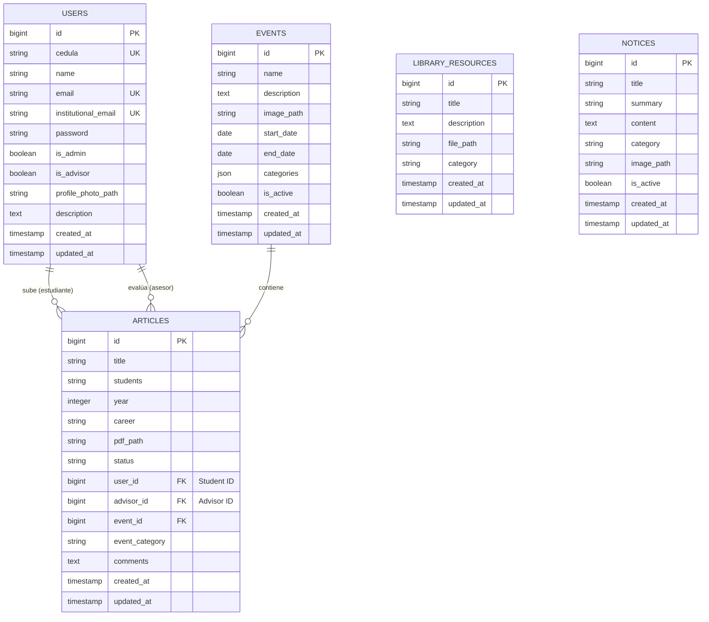

# Diagrama Entidad-Relación (ERD) - Laravel UTP

Este documento describe la estructura de la base de datos del proyecto **laravelutp**.

## 1. Análisis de Entidades Principales

### Usuarios (`users`)
Representa a los estudiantes, asesores y administradores del sistema.
- **Campos clave**: `cedula`, `email`, `institutional_email`, `is_admin`, `is_advisor`.

### Artículos (`articles`)
Trabajos de investigación o proyectos subidos por los estudiantes.
- **Relaciones**:
    - Un artículo pertenece a un **Estudiante** (`user_id`).
    - Un artículo es revisado por un **Asesor** (`advisor_id`).
    - Un artículo puede estar vinculado a un **Evento** (`event_id`).

### Eventos (`events`)
Convocatorias o actividades académicas.
- **Relaciones**: Un evento puede tener múltiples artículos asociados.

### Recursos de Biblioteca (`library_resources`)
Documentos de apoyo y recursos digitales.

### Avisos (`notices`)
Comunicados y noticias del sistema.

---

## 2. Diagrama ER (Mermaid)

---

## 3. Detalle de Relaciones

1.  **Users -> Articles (1:N)**: Un usuario (estudiante) puede subir varios artículos. Un artículo solo pertenece a un estudiante.
2.  **Users -> Articles (1:N)**: Un usuario (asesor) puede evaluar varios artículos.
3.  **Events -> Articles (1:N)**: Un evento agrupa múltiples artículos presentados.
4.  **Library Resources & Notices**: Son entidades independientes que proporcionan información y recursos al sistema.

---

## 4. Consideraciones Técnicas
- **Soft Deletes**: Actualmente no se observan `deleted_at` en los modelos, se recomienda implementarlos para auditoría.
- **Integridad Referencial**: Los campos `user_id`, `advisor_id` y `event_id` en `articles` deben tener restricciones de clave foránea con `onDelete('cascade')` o `onDelete('set null')` según la lógica de negocio.
- **Categorías**: Los eventos usan un campo JSON para categorías, lo que ofrece flexibilidad pero dificulta las consultas complejas por categoría si el volumen de datos crece.
